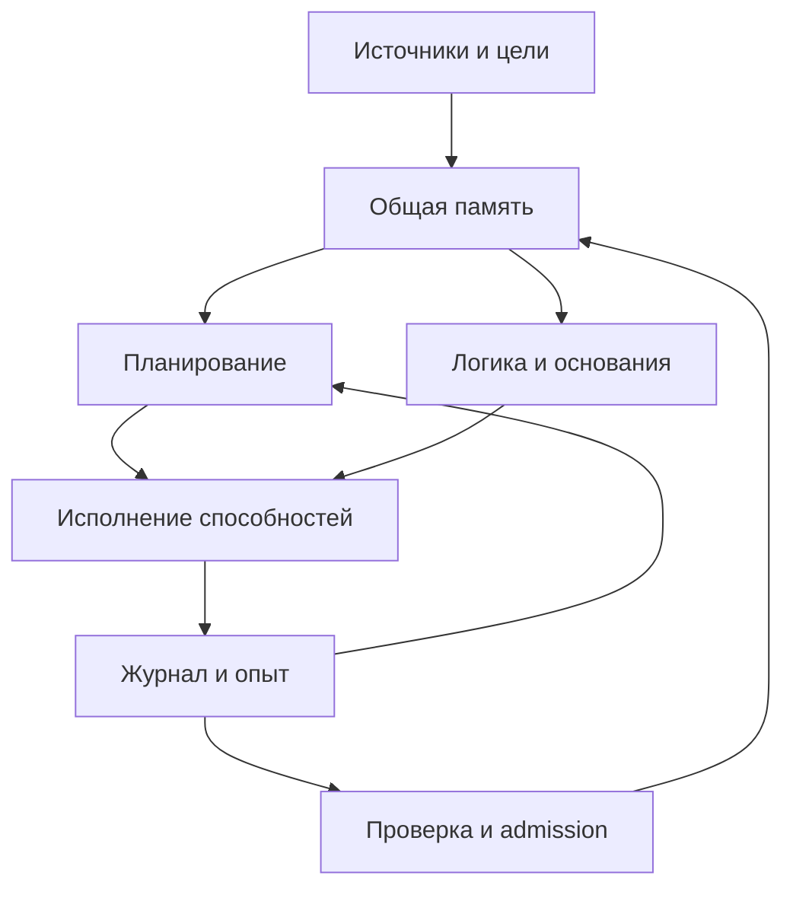

# Единое ядро NOVA 1.0

Основной runtime — `Kernel` в этом каталоге, публичная команда — `nova`.
Одна SQLite-база содержит общий журнал. Из него восстанавливаются память,
активный геном, цели, планы, результаты, опыт исполнения и история допусков.
В обычном цикле не создаются отдельные экземпляры Nova и Nova Next с собственными
базами. Их проверенные функции используются как библиотеки исполнения и обучения.

## Что объединено

| Составная часть | Работа в едином ядре | Проверка |
| --- | --- | --- |
| Память | Состояния Nova G22 и Next G2 перенесены вместе с задачами, генами, политикой поиска, знаниями, источниками и ожидающим кандидатом | Оба родительских журнала полностью воспроизведены; 134 и 26 событий |
| Логика | Вывод по правилам с переменными, цепочки оснований, явное отрицание и ответы TRUE/FALSE/BOTH/UNKNOWN | Транзитивный вывод на реальных связях исходника; тесты противоречий и неподтверждённых утверждений |
| Мышление | Поиск последовательности действий по входным и выходным типам доступных способностей | Ядро составило и исполнило план из девяти действий |
| Интеллект — в операционном смысле | Выбор следующего действия, приоритет незавершённой проверки, изменение стоимости действий по успешным и неуспешным исполнениям | Контрольный тест меняет выбранный маршрут после накопленных ошибок |
| Код и навыки | Один каталог объединяет 21 навык Nova, три приобретённых графовых программы, расширения языка, шесть исходных UCR-примитивов, reader и инструменты логики | 24 приобретённых навыка; всего 41 запись каталога |
| Обучение | Прежний синтез выражений и графовый синтез используют общую очередь, общий admission и регрессию обоих доменов | Проверены новое выражение в тесте и реальный графовый admission |
| Интернет | Источники добавляются событием в существующую историю, в том числе после исчерпания первоначального пула | Два новых HTTPS-источника продолжили уже зафиксированного кандидата |



Прикладные библиотеки остаются в нескольких файлах. Единство означает одного
владельца состояния, очереди, рабочего контекста и решений о допуске.
Каталог строится по активному геному; недопущенные программы в него не попадают.

## Проверенный сетевой результат

Изначально общий checkpoint содержал 23 приобретённых навыка и замороженного
кандидата на подсчёт косвенно достижимых пар. Его код перенесён без изменения.
После фиксации протокола ядро получило исходники Tenacity и Tornado.

| Проверка кандидата | Результат |
| --- | --- |
| Fresh-blind | 24/24 представления графов из двух новых репозиториев |
| Лучший ответ без нового кандидата | 18/24 |
| Удаление используемого приобретённого механизма достижимости | 8/24 |
| Регрессия навыков Nova | 192/192 |
| Регрессия всех трёх графовых навыков | 72/72 |
| Допуск | Принят в общий геном, Unified U1 |

24 случая — это индуцированные подграфы двух источников, а не 24 независимых
репозитория. Ablation действительно пересобирает программу без зависимости
и исполняет её. История свежих данных сохраняется после отката.

Затем ядро самостоятельно составило следующий план для заданной оператором цели
«получить отчёт об исходнике»:

1. Применить приобретённый навык Nova к названию.
2. Получить сохранённый HTTPS-захват из общей памяти.
3. Прочитать его через UCR с проверкой восстановления байтов.
4. Построить статический граф.
5. Выполнить приобретённый подсчёт косвенных пар.
6. Выполнить приобретённую оценку максимальной достижимости.
7. Выполнить приобретённый подсчёт достижимых пар.
8. Построить логические основания отчёта.
9. Собрать результат.

Для захваченного файла Tenacity: 52 функции, 11 статических связей вызова,
16 достижимых пар, пять косвенных пар, максимальная достижимость — четыре.
Результат сопоставлен с отдельным оракулом. Дополнительно модуль логики построил
транзитивное следствие по двум реальным связям исходника.

Графы описывают частично разрешённые синтаксические вызовы. Эти числа не являются
измерением фактического поведения программы или доказанной динамической причинности.

## Запуск проверенного состояния

Нужны Linux x86-64, Python 3.12 для точного replay поставленного опыта и интернет
для новых загрузок. Сами сгенерированные программы работают в отдельных
ограниченных процессах с seccomp, без доступа к сети и файлам.

```bash
python -m pip install .
nova --state /tmp/nova.sqlite restore experience/unified-v1/live/journal.json.gz
nova --state /tmp/nova.sqlite status
nova --state /tmp/nova.sqlite catalog
nova --state /tmp/nova.sqlite think
nova --state /tmp/nova.sqlite verify
```

Восстановление переносит уже проверенные 24 навыка и результаты совместного плана.
Команда `init` создаёт исходный checkpoint объединения: 23 навыка и ожидающий
кандидат. Она предназначена для нового прогона миграции и развития.

```bash
nova --state /tmp/nova.sqlite inspect https://raw.githubusercontent.com/jd/tenacity/main/tenacity/__init__.py --label "Tenacity source"
nova --state /tmp/nova.sqlite invoke skill:30-record --input '{"text":"  единое ядро  "}'
nova --state /tmp/nova.sqlite export --output /tmp/nova-journal.json.gz
```

Добавить источники в существующее состояние:

```bash
nova --state /tmp/nova.sqlite connect feeds.json
nova --state /tmp/nova.sqlite run --steps 20
```

`feeds.json` содержит от двух до 32 объектов `{"url":"https://…/source.py","module":"package.module"}`.
За одну историю допускается до 256 адресов. Источники не содержат выбранных задач
или ответов. Добавление не снимает фиксацию кандидата и не обнуляет свежесть.
Если кандидат ожидает проверку, произвольное получение незнакомого исходника
через прикладной план блокируется до завершения зарезервированной проверки.

`learn`, `study`, `engine-trial` и `assess` предоставляют прежние пути обучения
выражений, чтения спецификаций, испытания поисковой политики и fresh-оценки.
`observe-state` и способность `state.predict` используют унаследованный fitter;
неоднозначность возвращается явно. Такие прогнозы не считаются новым admission.

Для произвольной поддержанной цели используйте `goal TARGET --input JSON`,
где JSON связывает типы входов со значениями. Например, `code.report` принимает
`source.url` и `input.text`. Ядро само ищет план по каталогу. При отсутствии
подходящих способностей цель получает `BLOCKED`, а результат не выдумывается.

Работа конечная: `run --steps N` выполняет не более N шагов. После выхода процесса
ядро не продолжает работать в фоне.

## Проверяемость и совместимость

```bash
python -m unittest discover -s tests -v
python scripts/verify_release.py
python scripts/verify_nova_next.py
python scripts/verify_unified.py
```

`verify_unified.py` без интернета воспроизводит единый журнал, проверяет совместный
план, регрессию обоих доменов, холодный перезапуск и откат. Подмена результата
отклоняется даже после пересчёта цепочки хешей; JSON-тип `true` не принимается
вместо числа `1`.

`bootstrap.json.gz` — зафиксированный checkpoint двух проверенных родителей.
Это явный корень доверия релиза, а не самостоятельно доказывающий себя снимок.
Его можно пересобрать командой `python scripts/build_unified_checkpoint.py`
из опубликованных родительских журналов; существующий checkpoint не заменяется,
если пересобранное содержимое отличается. Это длительная полная проверка истории.

`nova-legacy`, `nova-next` и прежние Python-модули сохранены для исторического replay.
Активный runtime указан в `canonical/active.json`; обычная работа идёт через `nova`.
Все 11 дополнительных веток включены в историю `main`; их ссылки оставлены как
история разработки. Устаревший самостоятельный интернет-прогон также сохранён.

## Что ещё не доказано

Модули логики, планирования и управления написал разработчик. Ядро выбирает
планы и синтезирует программы внутри предоставленных языков. Логика ограничена
правилами Horn и бюджетом вывода, планирование — типизированными действиями,
самостоятельные графовые цели — тремя структурными спецификациями.

Стоимость действий меняется по наблюдаемым ошибкам. Проверено изменение маршрута
в контролируемом тесте; улучшение общего интеллекта этим не измерено. Логическое
основание означает вывод из конкретных фактов и правил, а не гарантию истинности
произвольных внешних сведений.

В Unified U1 объединены Nova G22 и графовая линия, дошедшая до G3. Это собственная
нумерация общего генома. Сознание, субъективный опыт, универсальное понимание языка
и неограниченное самоизменение остаются недоказанными целями проекта.
